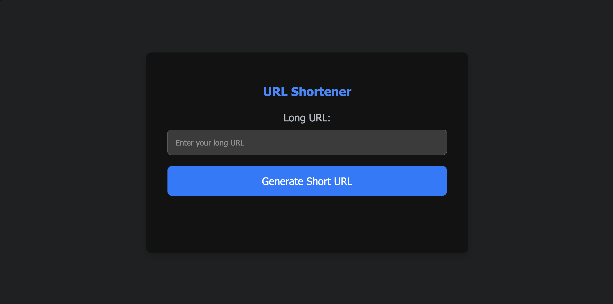

# tinuy-url
A service to take long urls and make them small for users

Uses Thymeleaf in order to display a basic UI that the user can interact with as shown below:

Uses GitHub Actions CI/CD to deploy to Azure App Service, and Azure Redis.
[See](short-urls.azurewebsites.net/url)

## Running Locally

1. Run `docker compose up -d`
2. Run `TinyUrlApplication`
3. Use postman or another tool to hit the endpoints

